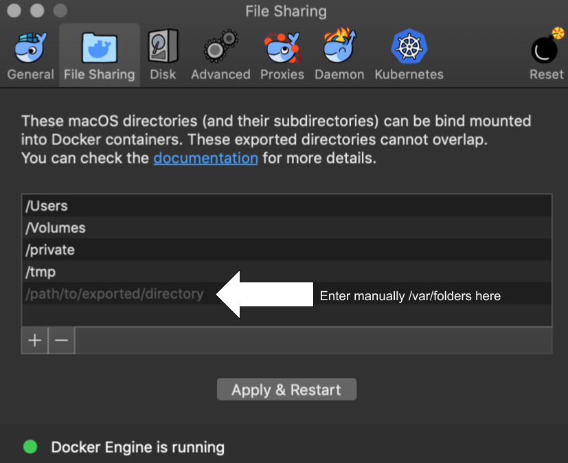

Install
=======

TractoFlow pipeline
-------------------

Release
#######

Download the last release of TractoFlow pipeline:

::

    $> wget https://github.com/scilus/tractoflow/archive/2.0.1.zip && unzip 2.0.1.zip

For developers
##############

Clone TractoFlow pipeline repository:

::

    # Clone with HTTPS
    $> git clone https://github.com/scilus/tractoflow.git

    # Clone with SSH
    $> git clone git@github.com:scilus/tractoflow.git

.. _singularity-tractoflow:

Singularity for TractoFlow
--------------------------

Release
#######

Download the last release of the Singularity container for TractoFlow:

::

    $> wget http://scil.usherbrooke.ca/containers_list/tractoflow_2.0.0_8b39aee_2019-04-26.img

For developers
##############

Clone the singularity repository for TractoFlow pipeline:

::

    # Clone with HTTPS
    $> git clone https://github.com/scilus/singularity-tractoflow.git

    # Clone with SSH
    $> git clone git@github.com:scilus/singularity-tractoflow.git

Then, you can build the singularity image:

::

    $> singularity build singularity_name.img singularity_tractoflow.def

.. _docker-tractoflow:

Docker for TractoFlow
---------------------

First, please bind /var/folders in Docker (Preferences -> File Sharing).

- Add manually /var/folders (see figure below).

- Click on Apply & Restart.

Then, change the number of CPUs and RAM (recommended: 8 CPUs and 16Gb of RAM) in
Docker (Preferences -> Advanced) and click on Apply & Restart.

Release
#######

Download the last release of the Docker container for TractoFlow:

::

    $> wget http://scil.usherbrooke.ca/containers_list/docker_tractoflow_2.0.0_a0cacfb_2019-04-25.tar.gz

Install the Docker container:

::

    $> docker image load -i "docker_tractoflow_2.0.0_a0cacfb_2019-04-25.tar.gz"

