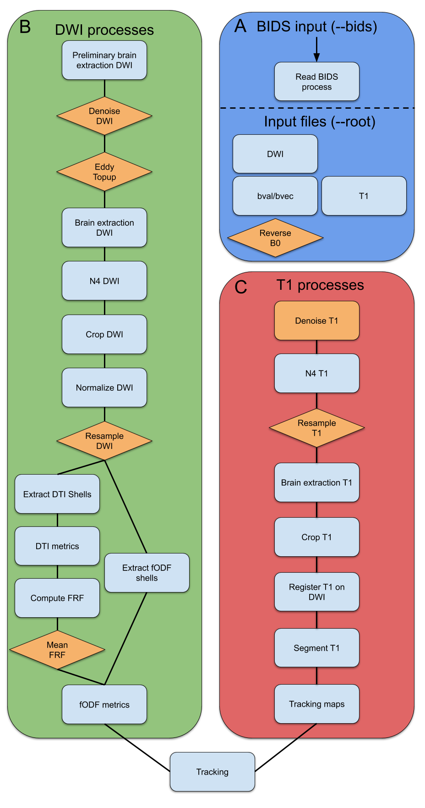

Processing steps
================

TractoFlow pipeline consist of 23 different steps : 14 steps for the diffusion
weighted image (DWI) processing and 8 steps for the T1 weighted image processing.

Input
-----
    * Diffusion weighted image (DWI)
    * b-values
    * b-vectors
    * T1 weighted image
    *  Reverse phase encoding B0 (Optional)

DWI processes
-------------
    * Brain extraction (FSL)
    * Denoising (Mrtrix3)
    * Topup (FSL)
    * Eddy (FSL)
    * N4 bias correction (ANTs)
    * Resample (Dipy)
    * DTI metrics (Dipy)
    * fODF metrics (Dipy)

T1 processes
------------
    * Brain extraction (ANTs)
    * Denoising (Dipy)
    * N4 bias correction (ANTs)
    * Resample (Dipy)
    * Registration (ANTs)
    * Tissue segmentation (FSL)

Tractography
------------
The particle filter tractography is performed. Two types of seeding is available: WM-GM interface or WM mask.
